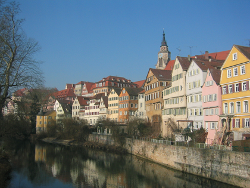

# Neural Style Transfer

This work is based on [Neural Algorithm of Artistic Style](https://arxiv.org/abs/1508.06576) by Leon A. Gatys et al. and PyTorch's official tutorial [Neural Transfer with PyTorch](http://pytorch.org/tutorials/advanced/neural_style_tutorial.html).

You can enable the GPU computation by setting global variable ```USE_GPU = True``` at line 15 in main.py

Also, layers to calculate content loss and style loss can be selected at line 52 and 53 in main.py, feel free to try out different configuration.

During the transfer, you'll probably get a HORRIBLY LARGE loss. I'm still working on this issue.

Here are some results...

   

The content image [Tübingen, Germany: Neckarfront](https://commons.wikimedia.org/wiki/File:Tuebingen_Neckarfront.jpg) is photographed by [Andreas Praefcke](https://commons.wikimedia.org/wiki/User:AndreasPraefcke), licensed under the [Creative Commons Attribution 3.0 Unported](https://creativecommons.org/licenses/by/3.0/deed.en) license.
